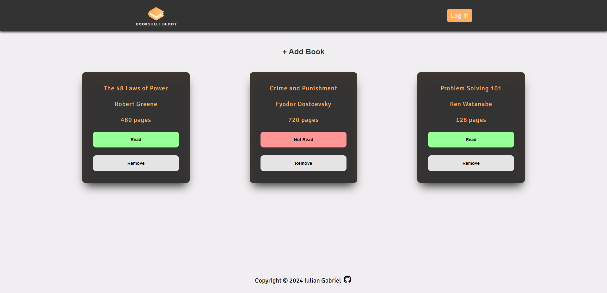

<h1 align="center">Bookshelf Buddy</h1>

<p align="center">
  
</p>

<p align="center">
  <a href="https://iuliangabriel.github.io/Bookshelf-Buddy/" style="display:inline-block;">Live App</a>
</p>

## Features

- **Add Books:** Easily add new books to your virtual bookshelf, including details such as title, author, number of pages, and whether you've read the book or not.
- **Remove Books:** Remove books from your library with a click of a button. The library and user interface are dynamically updated to reflect the changes.
- **Mark as Read/Unread:** Toggle the status of a book between "Read" and "Not Read" with a dedicated button. The button color changes dynamically to reflect the status.
- **Local Storage:** Your book library is saved to local storage, ensuring that your book collection persists even when you close or refresh the page.

## Technologies used
- HTML5
- CSS3
- JavaScript

## Installation

1. Clone the repository:

  ```bash
   git clone https://github.com/IulianGabriel/Bookshelf-Buddy
